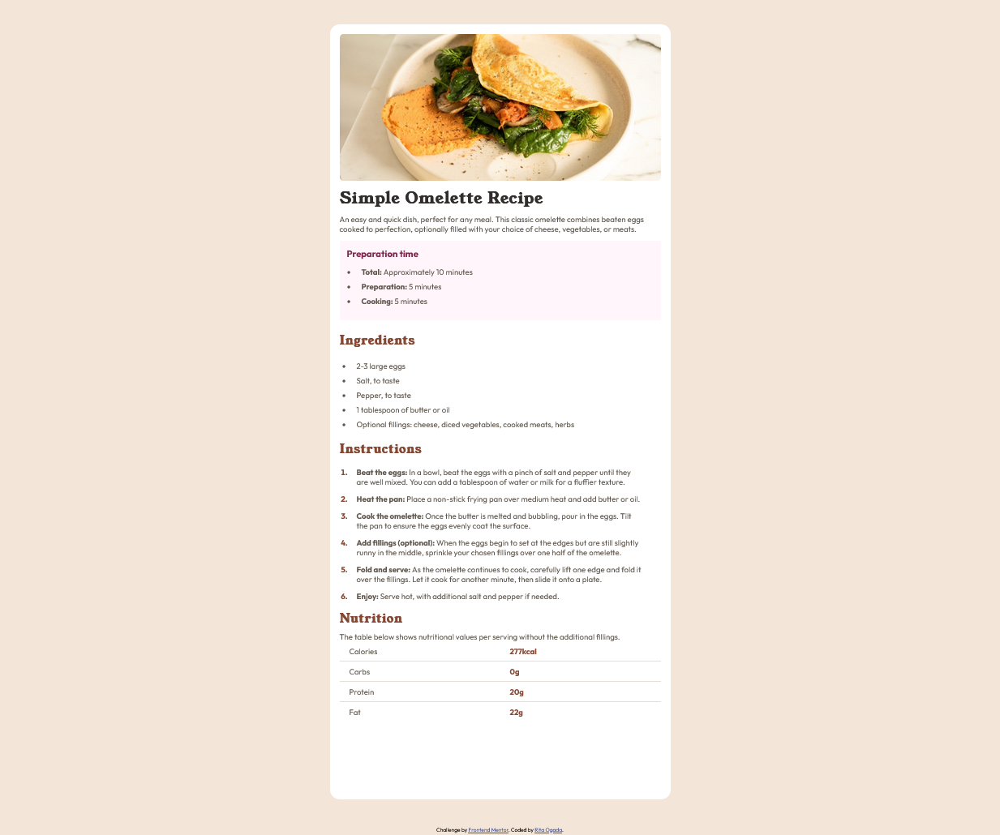

# Frontend Mentor - Recipe page solution

This is a solution to the [Recipe page challenge on Frontend Mentor](https://www.frontendmentor.io/challenges/recipe-page-KiTsR8QQKm).

## Table of contents

- [Overview](#overview)
  - [Screenshot](#screenshot)
  - [Links](#links)
- [My process](#my-process)
  - [Built with](#built-with)
  - [What I learned](#what-i-learned)
  - [Continued development](#continued-development)
  - [Useful resources](#useful-resources)
- [Author](#author)

## Overview

### Screenshot

Here's the screenshot of the page created:



### Links

- Solution URL: [https://github.com/ritaogada/recipe-page.git]
- Live Site URL: [Add live site URL here](https://your-live-site-url.com)

## My process

### Built with

- Semantic HTML5 markup
- CSS custom properties
- Flexbox
- CSS Grid

### What I learned

I still feel I have much more to learn, but here's a code I'm truly proud of, no matter how simple it looks!

```css
tr {
  border-bottom: 1px solid var(--Light-grey);
}

tr:last-child {
  border-bottom: none;
}
```

The above code is what helped me create a line in between rows in the nutrition table. Simple as it looks, this easy code was a breather after hours of searching how to add lines in between rows in a table. ChatGPT helped me navigate this easily.

### Continued development

I now want to start using frontend libraries such as Tailwind CSS and Sass (Syntactically Awesome Stylesheets). I'll also dive into web development projects that incorporate JavaScript and associated libraries like React, Angular and Vue.js.

### Useful resources

- ChatGPT ;D

## Author

- Frontend Mentor - [@ritaogada](https://www.frontendmentor.io/profile/ritaogada)
- Twitter - [@RitaOgada](https://x.com/RitaOgada)
